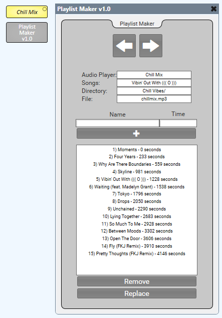

# Q-SYS Playlist Maker

This is a plugin that allows you to take a single audio file and dynamically turn it into a playlist of different songs. It also provides a drop-down to select from those songs as well next and back buttons to switch between them.

Click [here](https://qsc0-my.sharepoint.com/:f:/g/personal/maxx_sanner_qsc_com/EnH5SlzyQ9BKklXWwXX4lMsBlSswffPD5SqNbZANtsQGjA?e=aNOHpd) to download the plugin.

## How to Use

* Simply download the plugin and add it to your C:\Users\user\Documents\QSC\Q-Sys Designer\Plugins folder. 
* Drag into your schematic from the plugins section of your Schematic Elements. 
* You will need at least one named audio player component in the design. If you do not have an audio player component, the plugin will tell you do not have one. 
* Once you have a named audio component, it should auto-populate in the "Audio Player" field. If you have multiple audio players, you can click on this field to get a drop-down so that you can select the correct one.
* Next, select a Directory and a File. This will be the audio file that you are splitting into 'songs'.
* To create 'songs', simply enter a name in the Name field and a Time (in seconds) that the song starts. Click the "+" button and you will see it added to your list of songs.
* When 'songs' are added, you'll notice they not only appear in the list box below the '+' button, but they also show up in the Songs field as a drop-down. This allows the user to select which song they want to skip to on the audio player.
* You'll also notice that if you have multiple audio files that you are turning into playlists, when you swap between them, the songs that you have added for each file will remain. This is because the data is stored on the Core as .json files.
* You can remove a song by clicking on it in the list box and then clicking the 'Remove' button.
* You can edit a song by typing a new name and time, selecting the one you want to replace, and clicking the 'Replace' button.

## How it Works

This plugin uses the following Q-SYS extensions to Lua:
* Components - This is used to tied the plugin to a named audio player.
* dir - This is used to select which directory and file on the Core is being used to create a playlist for. It is also used to create a ChillMixPlaylist directory in your Core's /media directory.
* RapidJSON - This is used to allow us to use JSON for easy reading and writing of information to and from the Core.

It also utilizes io.write and io.read for writing and reading the playlist information as JSON.

When songs are created (ie Name and Time have been input and the "+" button has been clicked), it writes (or adds to) a file called < name of file >.json to a chillMixPlaylist directory in your Core's /media directory. You can access these files by simply going to https://< IP of Core >/media/chillMixPlaylists (after at least one song is added as this is what adds the directory).

## Badges 
 
 

## Questions 
 For any questions, contact me at [maxxsanner105@gmail.com](mailto:maxxsanner105@gmail.com).
#### 

